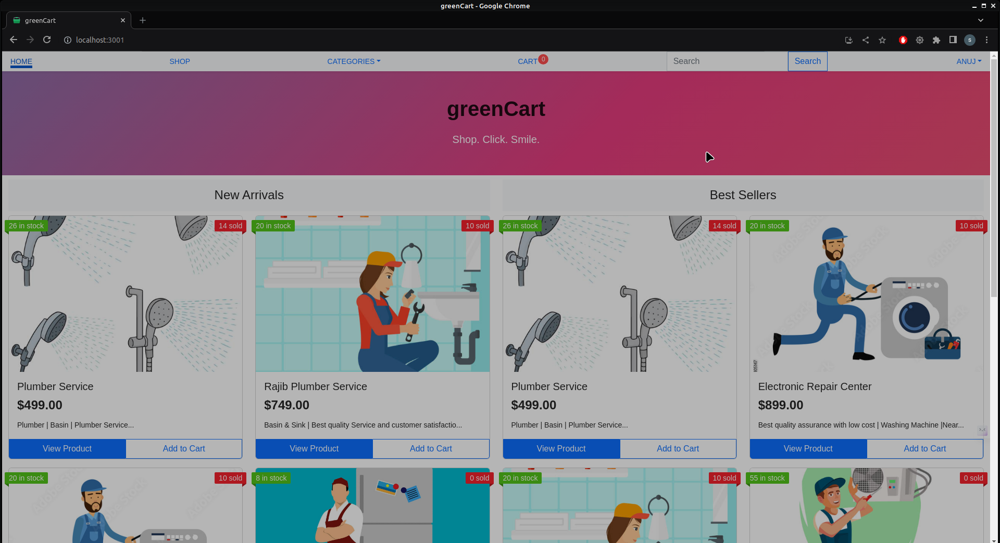
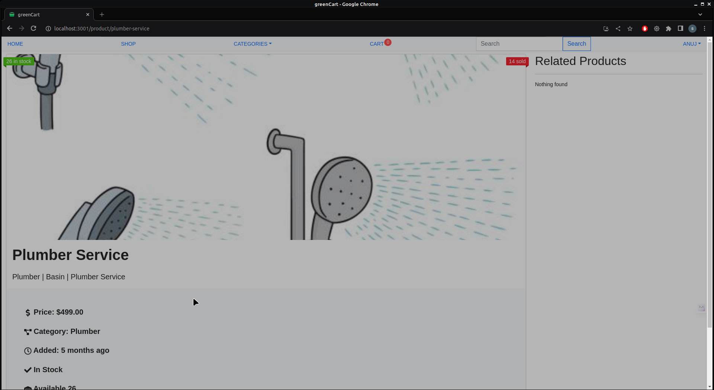
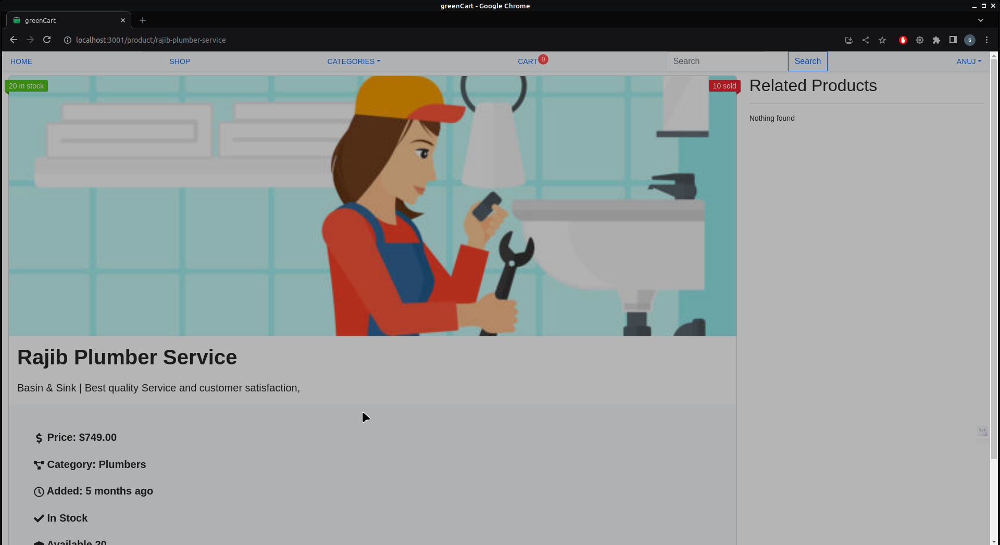
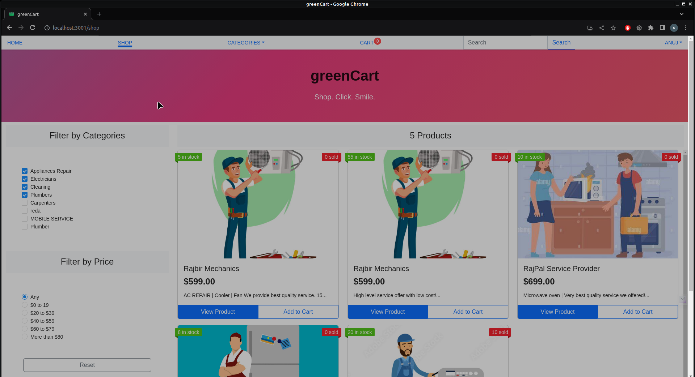
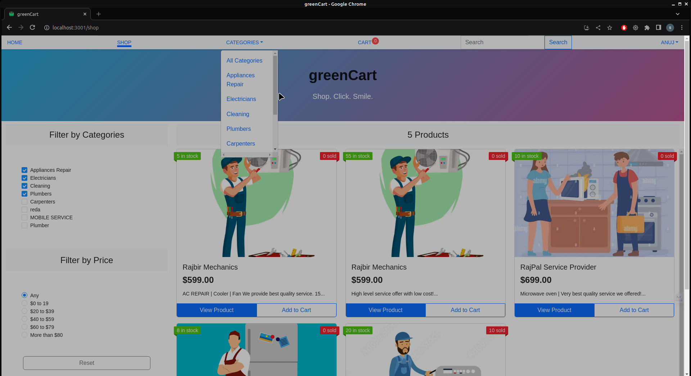
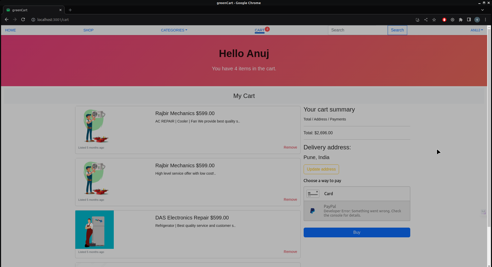
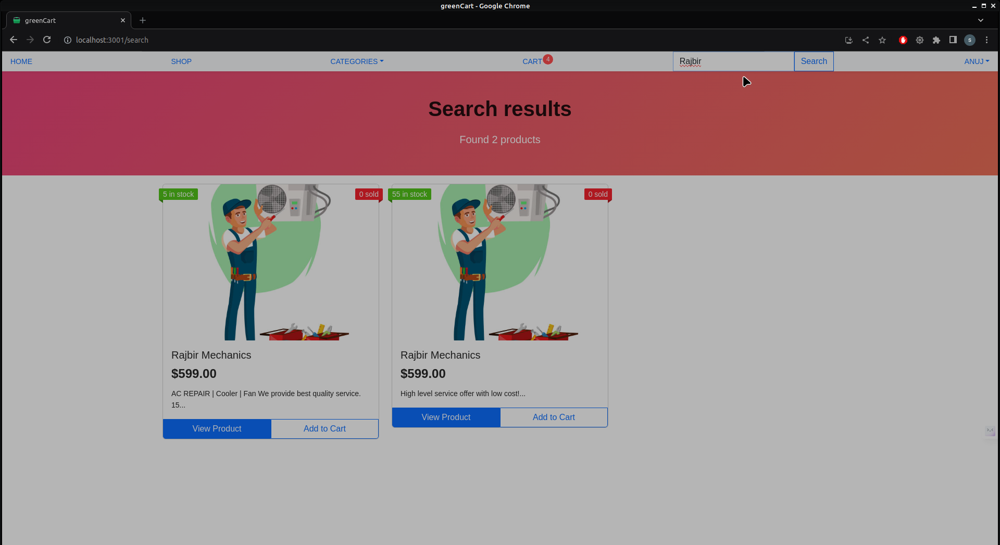
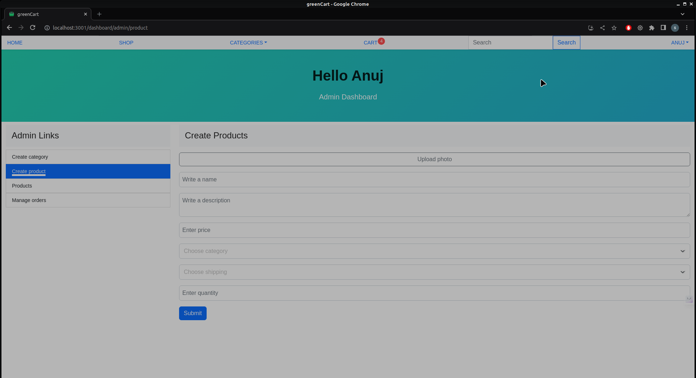
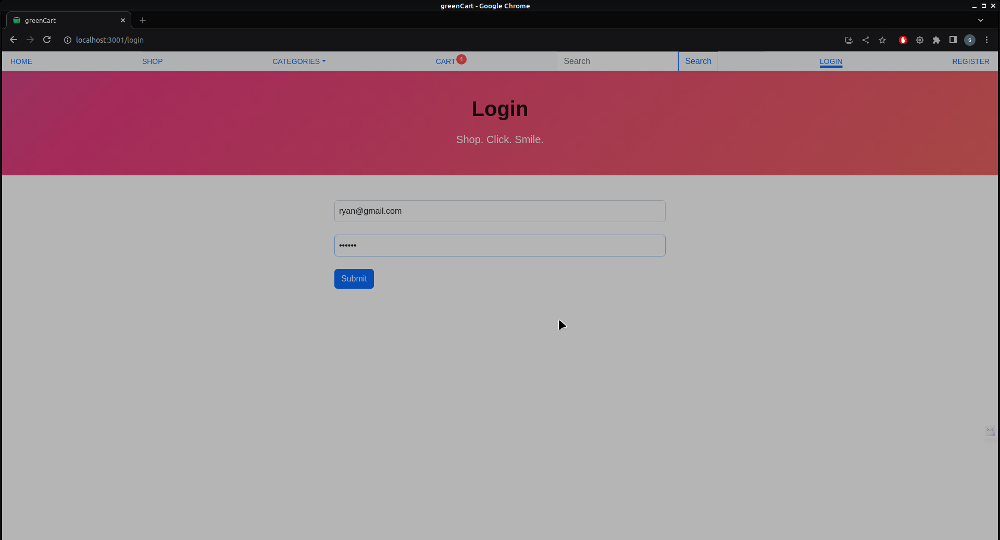

# greenCart | Ecommerce Web Application
End-to-end ecommerce platform utilizing the MERN stack.This application that seamlessly integrates a React frontend with an Express backend, offering and managing products and categories. The application utilizes MongoDB for data storage, providing a robust and scalable solution. The project also includes authentication features, ensuring secure access to the application.

## Features

- MERN Stack as MongoDB, ExpressJS, ReactJS, and NodeJS
- ReactJS for UI/UX, React Virtual DOM
- Authentication System using JSON Web Tokens (JWT)
- Cart System and payment process via Braintree.
- Admin Dashboard
- Database MongoDB Atlas
- Order Notifications notifications through SendGrid
- Deployment AWS(EC2)

## Local Setup

To Run this project

* Clone the repository
* Configure environment variables for MongoDB, Braintree, and SendGrid.
* Setup .env variables for both server and client

```bash
cd greenCart---Ecommerce-Web-Application/
npm install
cd greenCart---Ecommerce-Web-Application/client/
npm install
cd greenCart---Ecommerce-Web-Application/server/
npm install
```

* Split the terminal to run server & cline side

```
cd greenCart---Ecommerce-Web-Application/server
npm start
cd greenCart---Ecommerce-Web-Application/client
npm start
```

* Application will start or goto

```
http://localhost:3000
```

## Environment Variables

To run this project, you will need to add the following environment variables to your .env file

`OPENAI_API_KEY`
`PINECONE_API_KEY`
`PINECONE_ENV`
`PORT`
`MONGO_URI`
`JWT_SECRET`
`BRAINTREE_MERCHANT_ID`
`BRAINTREE_PUBLIC_KEY`
`BRAINTREE_PRIVATE_KEY`
`SENDGRID_KEY`
`EMAIL_FROM`
`CLIENT_URL`


## Screenshots











